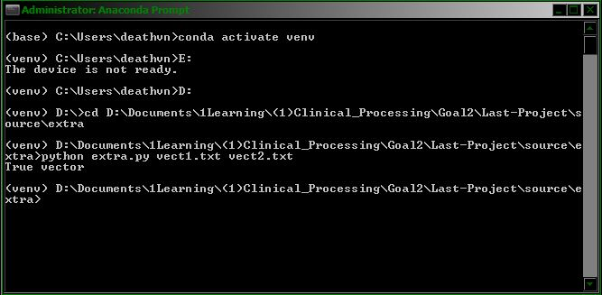

We have to reupload Goal 2   
Fixed bug: "basket2vec.py" work well with Ubuntu, but add unnecessary newline character when run on Windows machines.  
Now "basket2vec.py" works both well.
# Team: Last Project  
Extra Credit Assignment: vector file validation.
## Members:  
15520614 - Khả Phiêu  
15520182 - Ngọc Hải  
15521025 - Anh Vọng  
15520148 - Công Dương  
15520494 - Quang Minh  
15520996 - Tỷ Tỷ
## Usage:
Required:
```
python3
numpy
pandas
```
Run:
```shell
python extra.py <vector verified path> <vector test path>
```
Example:
```shell
python extra.py vect1.txt vect2.txt
```

